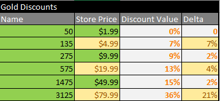

# Gaming_Spreadsheets
Hi, this repo showcases spreadsheet data layout and management for a variety of gaming features.  
There's a Crafting Simulator to calculate how long it takes to make an item. 
<b>Crafting</b>
   

An example structure for how to set up and tune in-game progression for an imaginary Strategy/Builder game.  
<b>Progression</b>
   

A hypothetical structure for setting up an card database for a card game. 
<b>Inventory</b>
   

<<<<<<< HEAD
A cursory breakdown of Cookie Jam Blast's store and pricing
<b>Pricing</b>
   
=======
A cursory breakdown of Cookie Jam Blast's store and pricing. 
<b>Pricing</b> 
   
>>>>>>> f3662be8402fc8aa5508f8567460b8598fde396c

Files are currently locked behind a password, message me at tedlim@alumni.stanford.edu for access.
