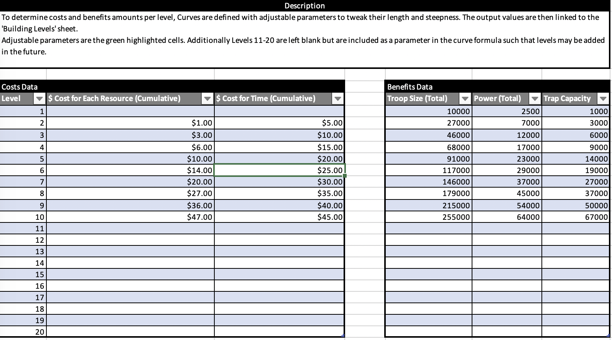

# Spreadsheets
Hi, this repo showcases spreadsheet data layout and management for a variety of gaming features.  

There's a Crafting Simulator to calculate how long it takes to make an item. 
<b>Crafting</b>
   

An example structure for how to set up and tune in-game progression for an imaginary Strategy/Builder game.  
 Progression</b>
   

A hypothetical structure for setting up an card database for a card game. 
<b>Inventory</b>
   

Files are currently locked behind a password, so if you want access, message me at tedlim@alumni.stanford.edu.
