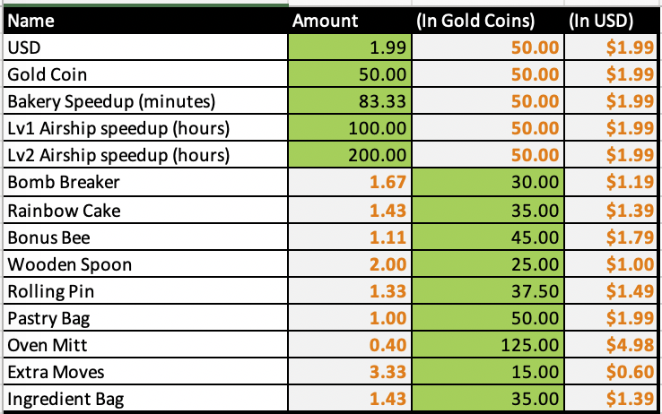

# Gaming_Spreadsheets
Hi, this repo showcases spreadsheet data layout and management for a variety of gaming features.  

<b>Crafting</b> 
There's a Crafting Simulator to calculate how long it takes to make an item. 
   

<b>Progression</b> 
An example structure for how to set up and tune in-game progression for an imaginary Strategy/Builder game.  
   

<b>Inventory</b> 
A hypothetical structure for setting up an card database for a card game. 
   

<b>Pricing</b> 
A cursory breakdown of Cookie Jam Blast's store and pricing. 
   

<b>Character Stats Calculator</b> 
A calculator to estimate FE3H character stats at given level based on equipped classes and natural stats progression.
   

Files are currently locked behind a password, message me at tedlim@alumni.stanford.edu for access.
